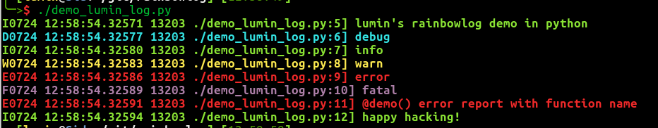
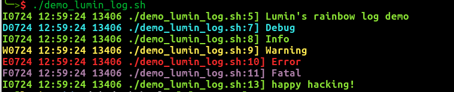

# rainbowlog
Colorful screen logging utility in GLOG style, avalable in multiple languages

Avalable languages:  
* Lua
* Python3
* Bash
* C

## Demo

#### Lua
  

#### Python3
  

#### Bash
  

#### C
  

### Reference
These files also appear in my repo:
  https://github.com/CDLuminate/withLinux  
And the C version originates from my utility `cda`:
  https://github.com/cdluminate/cda

## License

MIT license. The `C` version of rainbowlog is licended `GPL-3+`.
